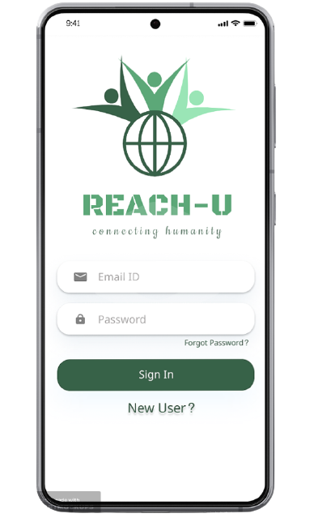

## IoT-Alliance Presents
<div align="center"> 
  <p align='center'> 
   
   
   <br>
    <br>

  </p>
  
  <br><br>
  <p>
  
  </p>
  
  <br><br>
 </div>
 
<div align="center"> 
    <p>
    </p>
  <p>Vehicular traffic is one of the greatest challenges faced by all major cities all over the world. Do you know as per the data released by the World Health Organization more than one million deaths each year are imputed to air pollution, of which a large proportion is caused by vehicular traffic? Horrifying, indeed.
It’s surprising that there are numerous personal as well as environmental benefits that car share and carpool offer to mankind, yet we are so hesitant to procure this smart solution.
  
  Secondly,The food that is wasted, impacts food security, resource conservation, and contributes to the methane emissions that come from landfills. Reducing the amount of food waste sent to landfills can help ease the impact of climate change and also put food in the mouths of millions of people.</p>
  <br><br>
 </div>

 <div align="center"> 
    <p>
    </p>
    
  <br><br>
 </div>

<div align="center"> 
    <p>
    </p>
    
  <br><br>
 </div>


<div align="center"> 
  <br><br>
  
  
  
  
  <br>
  <br>
  <br>
  <br>
  <br>
  
  
</div>
<br>
<br>
  <br>


 <br>
 


<div align="center"> 
   
</div>
  <br>
  
  
  
  #### Frontend
  
  ```
  - React Native
  ```
  
  #### Server | Backend
  
  ```
  - Node JS
  - Express
  - MongoDB
    
    Deployment
    - Heroku
    
   ```
  <div>

  <h3>API Documentation:</h3>

  <a href="https://documenter.getpostman.com/view/13595623/U16qH2T9"> https://documenter.getpostman.com/view/13595623/U16qH2T9 </a><br>

  </div>


  
  <br>
    
 <!-- END -->
